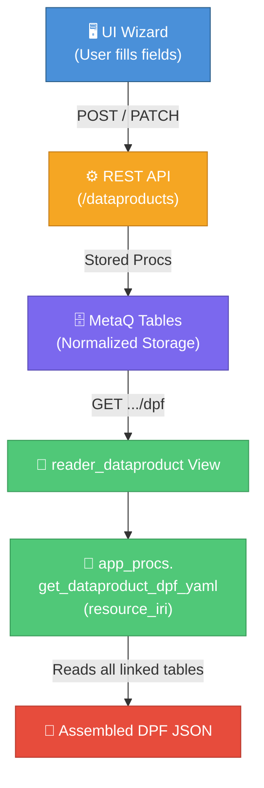
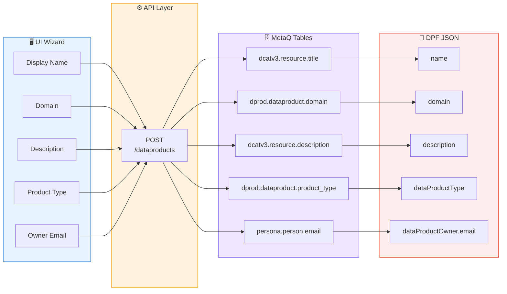
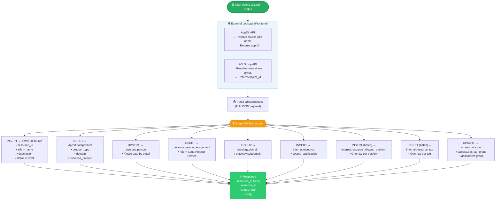
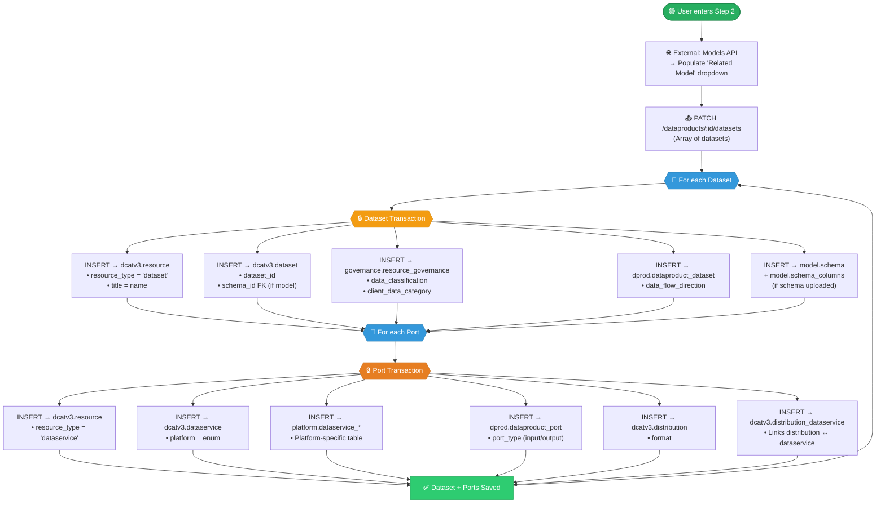
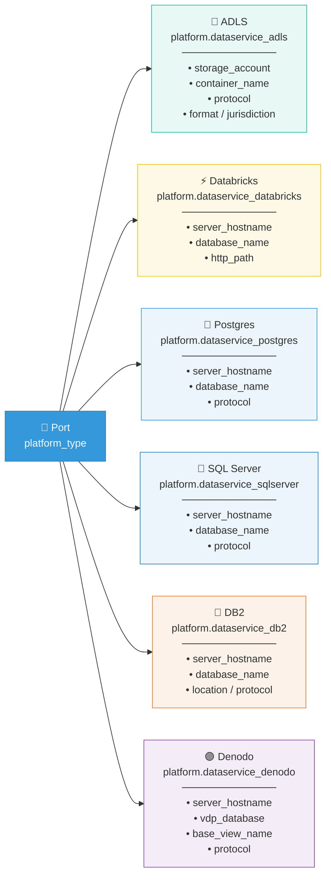
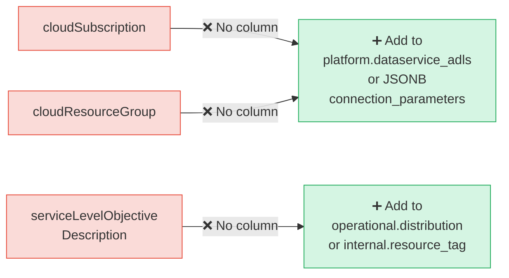
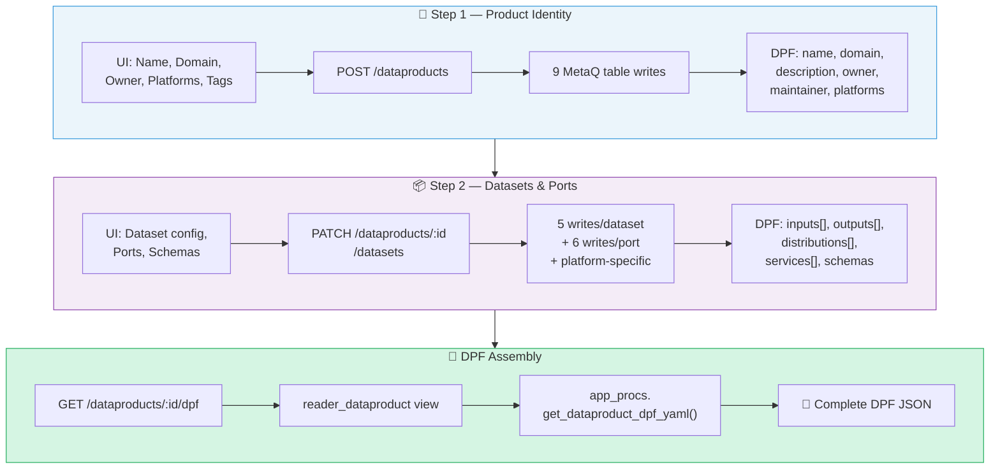

# 🏗️ DPF Data Flow Architecture

> **Purpose:** This document traces every DPF JSON field from the **UI Wizard** through **API calls**, into **MetaQ database tables**, and finally into the assembled **DPF output**. It covers Step 1 (Product Identity) and Step 2 (Dataset Configuration).

---

## 📌 High-Level Overview

The DPF JSON is the **target output**. Everything the wizard collects flows through MetaQ tables and gets assembled by `app_procs.get_dataproduct_dpf_yaml()` into the final format.



---

## 🔗 Complete Field Traceability

### DPF Field → MetaQ Table → API Stage



---

## 📝 Step 1 — Product Identity

> **Endpoint:** `POST /dataproducts`
> **Goal:** Register a new Data Product with its core metadata.

### Step 1 Flow Diagram



### Step 1 — Request Payload

```json
{
  "display_name": "WMA Account Master",
  "name": "wma-account-master",
  "description": "Consolidated account master for WMA",
  "product_type": "source_aligned",
  "source_application": "APP-12345",
  "owning_business_division": "Wealth Management Americas",
  "domain": "Account",
  "sub_domain": "Client Accounts",
  "maintainers_group": { "PROD": ["WMA-Data-Maintainers"] },
  "allowed_platforms": ["powerbi", "devpod"],
  "tags": [
    { "key": "cost-center", "value": "CC-12345" },
    { "key": "priority", "value": "P1" }
  ],
  "owner_email": "arpit.dave@ubs.com"
}
```

### Step 1 — Response

```json
{
  "resource_id": "uuid",
  "resource_iri": "urn:ubs:dataproduct:wma-account-master",
  "status": "draft",
  "etag": "\"v1-abc\""
}
```

### Step 1 — DB Write Summary

| Table | Operation | Key Fields |
|:------|:---------:|:-----------|
| `dcatv3.resource` | **INSERT** | `resource_id`, `resource_iri`, `resource_type='dataproduct'`, `title`, `description`, `status='draft'` |
| `dprod.dataproduct` | **INSERT** | `dataproduct_id`, `resource_id` FK, `product_type`, `domain`, `business_division`, `purpose` |
| `persona.person` | **UPSERT** | Find/create person by email |
| `persona.person_assignment` | **INSERT** | `person_id`, `role='Data Product Owner'`, `resource_id` |
| `ontology.domain` / `subdomain` | **LOOKUP** | Link domain/subdomain if they exist |
| `internal.resource` | **INSERT** | `source_application_name/id` (from AppDir) |
| `internal.resource_allowed_platform` | **INSERT** *(batch)* | One row per platform |
| `internal.resource_tag` | **INSERT** *(batch)* | One row per tag key-value |
| `access.principal` + `access.bbs_ad_group` | **UPSERT** | Maintainers group from AD lookup |

### Step 1 → DPF Fields Populated

```
✅ name                        ✅ domain
✅ description                  ✅ dataProductType
✅ sourceApplication            ✅ owningBusinessEntity
✅ dataProductOwner             ✅ maintainerGroup
✅ allowedOperationalPlatform
```

---

## 📦 Step 2 — Create & Configure Datasets

> **Endpoint:** `PATCH /dataproducts/:id/datasets`
> **Goal:** Attach one or more datasets with their ports, distributions, and schemas.
> ⚠️ *This is the most complex step — multiple sub-entities are created per dataset.*

### Step 2 Master Flow



### Step 2 — Request Payload (per dataset)

```json
{
  "datasets": [
    {
      "display_name": "Client Portfolio Holdings",
      "name": "wma_client_portfolio",
      "confidentiality_classification": "confidential",
      "cid_category": "CID",
      "description": "End-of-day portfolio positions",
      "related_model_id": null,
      "ports": [
        {
          "direction": "input",
          "platform_type": "adls",
          "auth_types": ["UAMI", "SPN"],
          "physical_schema_file": "<base64 or reference>",
          "platform_fields": {
            "storage_account": "wmastorageprod",
            "container_name": "portfolio-data",
            "protocol": "abfss",
            "format": "parquet",
            "jurisdiction": "US"
          }
        },
        {
          "direction": "output",
          "platform_type": "databricks",
          "auth_types": ["UAMI"],
          "physical_schema_file": null,
          "platform_fields": {
            "server_hostname": "adb-12345.azuredatabricks.net",
            "database_name": "wma_gold",
            "http_path": "/sql/1.0/warehouses/abc"
          }
        }
      ]
    }
  ]
}
```

### Step 2 — DB Writes per Dataset

| Table | Operation | Key Fields |
|:------|:---------:|:-----------|
| `dcatv3.resource` | **INSERT** | `resource_type='dataset'`, `title=name` |
| `dcatv3.dataset` | **INSERT** | `dataset_id`, `resource_id` FK, `schema_id` FK |
| `governance.resource_governance` | **INSERT** | `data_classification`, `client_data_category` |
| `dprod.dataproduct_dataset` | **INSERT** | `dataproduct_id`, `dataset_id`, `data_flow_direction` |
| `model.schema` + `model.schema_columns` | **INSERT** | If physical schema uploaded |

### Step 2 — DB Writes per Port

| Table | Operation | Key Fields |
|:------|:---------:|:-----------|
| `dcatv3.resource` | **INSERT** | `resource_type='dataservice'` |
| `dcatv3.dataservice` | **INSERT** | `dataservice_id`, `resource_id` FK, `platform=enum` |
| `platform.dataservice_*` | **INSERT** | Platform-specific table (see below) |
| `dprod.dataproduct_port` | **INSERT** | `dataproduct_id`, `dataservice_id`, `port_type` |
| `dcatv3.distribution` | **INSERT** | `distribution_id`, `dataset_id` FK, `format` |
| `dcatv3.distribution_dataservice` | **INSERT** | Links distribution ↔ dataservice |

### Platform-Specific Table Routing



### Step 2 → DPF Fields Populated

```
✅ inputs[]                    ✅ outputs[]
✅ inputs[].name               ✅ outputs[].confidentialityClassification
✅ inputs[].label              ✅ outputs[].clientIdentifyingDataCategory
✅ inputs[].source             ✅ distributions[]
✅ distributions[].name        ✅ distributions[].format
✅ distributions[].services[]  ✅ distributions[].physicalDataStructure[]
```

---

## ⚠️ DPF → MetaQ Field Mapping (Inputs & Outputs)

### Dataset-Level Fields

| DPF Field | MetaQ Table.Column |
|:----------|:-------------------|
| `inputs[].name` | `dcatv3.resource.title` *(prefixed by platform)* |
| `inputs[].label` | `dcatv3.resource.title` *(display name)* |
| `inputs[].source` | `internal.resource.source_application_url` |
| *direction* (input vs output) | `dprod.dataproduct_dataset.data_flow_direction` |

### Distribution-Level Fields

| DPF Field | MetaQ Table.Column |
|:----------|:-------------------|
| `distributions[].name` | `dcatv3.distribution` + `dcatv3.resource.title` |
| `distributions[].format` | `dcatv3.distribution.format` |
| `distributions[].services[].storageAccount` | `platform.dataservice_adls.storage_account` |
| `distributions[].services[].container` | `platform.dataservice_adls.container_name` |
| `distributions[].services[].protocol` | `platform.dataservice_adls.protocol` |
| `distributions[].services[].location` | `platform.dataservice_adls` *(derived)* |
| `distributions[].services[].environmentType` | `operational.distribution_environment.environment_type` |
| `distributions[].physicalDataStructure[].name` | `model.schema.schema_name` |
| `distributions[].physicalDataStructure[].path` | `operational.distribution.file_path` |
| `distributions[].physicalDataStructure[].physicalDataElement[]` | `model.schema_columns` |

### Output-Only Fields

| DPF Field | MetaQ Table.Column |
|:----------|:-------------------|
| `outputs[].confidentialityClassification` | `governance.resource_governance.data_classification` |
| `outputs[].clientIdentifyingDataCategory` | `governance.resource_governance.client_data_category` |
| `outputs[].distributions[].serviceLevelObjectiveDescription` | Step 5/6 SLO → `internal.resource_tag` or new column |

---

## 🚨 Schema Gaps

> These DPF fields currently have **no MetaQ home** and need resolution.



| DPF Field | Current Status | Recommendation |
|:----------|:--------------:|:---------------|
| `cloudSubscription` | ❌ Missing | Add to `platform.dataservice_adls` or store in JSONB `connection_parameters` |
| `cloudResourceGroup` | ❌ Missing | Same as above |
| `serviceLevelObjectiveDescription` | ❌ Missing | Add to `operational.distribution` or `internal.resource_tag` |

---

## 🔐 Auth Types Handling

Auth types (`UAMI`, `EVA`, `SPN`, `Certificates`) are stored as a **JSONB array** on the dataservice record, or as `internal.resource_tag` entries per dataservice resource.

---

## 🔁 End-to-End Recap



---

*Document generated for internal architecture reference.*
